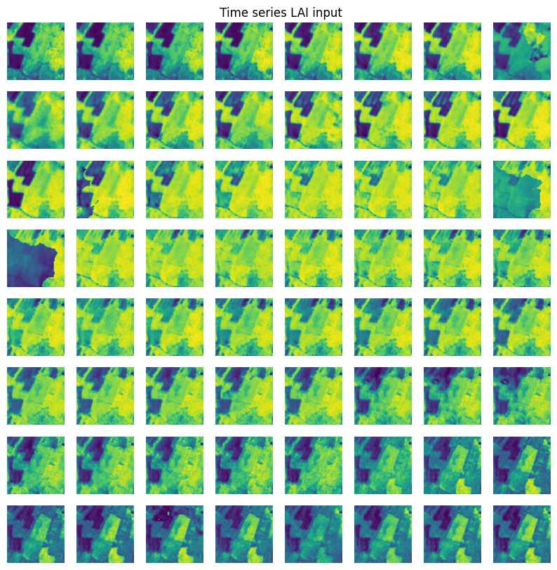

# stelar_3dunet
Bias mitigation strategies for agricultural crop type prediction using 3D U-net for spatio-temporal semantic segmentation


Code for 3D unet is adopted from Bhattiprolu, S. (2023). python_for_microscopists. GitHub. https://github.com/bnsreenu/python_for_microscopists/blob/master

Below is the dictionaly of crop types to predict with indices : 

{ 0:'NA' , 1: 'ALFALFA', 2: 'BEET', 3: 'CLOVER', 4: 'FLAX', 5: 'FLOWERING_LEGUMES', 6: 'FLOWERS', 7: 'FOREST', 8: 'GRAIN_MAIZE', 9: 'GRASSLAND', 10: 'HOPS', 11: 'LEGUMES', 12: 'VISTA_NA', 13: 'PERMANENT_PLANTATIONS', 14: 'PLASTIC', 15: 'POTATO', 16: 'PUMPKIN', 17: 'RICE', 18: 'SILAGE_MAIZE', 19: 'SOY', 20: 'SPRING_BARLEY', 21: 'SPRING_OAT', 22: 'SPRING_OTHER_CEREALS', 23: 'SPRING_RAPESEED', 24: 'SPRING_RYE', 25: 'SPRING_SORGHUM', 26: 'SPRING_SPELT', 27: 'SPRING_TRITICALE', 28: 'SPRING_WHEAT', 29: 'SUGARBEET', 30: 'SUNFLOWER', 31: 'SWEET_POTATOES', 32: 'TEMPORARY_GRASSLAND', 33: 'WINTER_BARLEY', 34: 'WINTER_OAT', 35: 'WINTER_OTHER_CEREALS', 36: 'WINTER_RAPESEED', 37: 'WINTER_RYE', 38: 'WINTER_SORGHUM', 39: 'WINTER_SPELT', 40: 'WINTER_TRITICALE', 41: 'WINTER_WHEAT'}

### Data preparation:

1. make directory `mkdir dataset/france2/lai_ras`
2. move LAI.zip to `./dataset/france2/lai_ras/` and unzip it. 
3. make directory `mkdir stelar_3dunet/dataset/france2/processed_lai_npy`
4. Run `python data_saving_france_RAS_npy.py` to save time series `.npy` files in the directory `./dataset/france2/processed_lai_npy/`


### Scarcity-Aware Data Slicing and Sampling:

We perform spatio-temporal data slicing and sampling as the dataset is as large as (10002x10002x256). In order to ensure representation of all necessary crop types in the training subsets to train the ensamble of models, we perform data slicing and sampling conditioned with positional information of the crop types . 

Run the below code :

`export CUDA_VISIBLE_DEVICES=1`

`cd stelar_3dunet/`

`conda activate inn`

`python traiing_data_per_crop.py --chosen_crop_types 27`

### Crop subgrouping

Each of the models in the ensemble is trained with the below subgroups of crop types
Subgroup_indices = [ 1,  2,  3],[4,  5,  7],[ 8,  9, 10],[ 11, 12, 13],[14, 15, 16],[18, 19, 20],[21, 23, 27],[28, 30, 32],[33, 34, 35],[36, 37, 40, 41]


### Training: 

We train each of the models in the ensamble separately

`export CUDA_VISIBLE_DEVICES=0 `

`conda deactivate`

`conda deactivate`

`cd stelar_3dunet/`

`source spt19/bin/activate`

`python3 3D_unet_data_generator_check_pt.py --crop_1 28 --crop_2 30 --crop_3 32`

### How to save the test sets of all the subsets of data with which the models are trained 

`export CUDA_VISIBLE_DEVICES=1`

`conda deactivate`

`conda deactivate`

`cd stelar_3dunet/`

`source spt19/bin/activate`

`python3 test_set_saving_10000_spt_points.py --crop_1 21 --crop_2 23 --crop_3 27`

`python3 test_set_saving_10000_spt_points.py --crop_1 28 --crop_2 30 --crop_3 32`

`python3 test_set_saving_10000_spt_points.py --crop_1 33 --crop_2 34 --crop_3 35`

`python3 test_set_saving_10000_spt_points.py --crop_1 36 --crop_2 37 --crop_3 40`

`python3 test_set_saving_10000_spt_points.py --crop_1 37 --crop_2 40 --crop_3 41`


### To save the ground truths and predictions for a given experiment and prepare for evaluation

`cd stelar_3dunet/`

`python outputs_and_ground_truth_saving.py`

### To replicate the quantitative results

Check : `ensamble_quantitative analysis_of_results.ipynb`

# Ensamble of models

## Experiment 0

This is a small scale example with lower coverage of landscape and less number of crop types. In this experiment we just considered the 10 percent of overall landscape. We consider corpp types ALFALFA, FOREST, GRAIN_MAIZE, GRASSLAND, LEGUMES, PERMANENT_PLANTATIONS and TEMPORARY_GRASSLAND and train three models to predict these crop types: 

Below are the results: 

### Considered crop type distribution


### Intersection over union for crop types


#### Qualitative results : 

1. Sample 1


1. Sample 2


1. Sample 3


## Experiment 1 
We train 11 different models such that each model predicts three crop types. We then create an ensamble of models and post process a cosolidated crop type prediction by the ensamble of models on a given spatio-temporal patch. 

Each of the 11 models trained as follows :

model 1 : 
    types : NA, ALFALFA, BEET, CLOVER
    samples : 850 each

model 2 : 
    types : NA, FLAX, FLOWERING_LEGUMES, FOREST

    .
    .
    .
model 11:
    ...

#### Crop type representation in training data


### Intersection over union for crop types


TOo plot ther IOU for experiment 1, refer to the jupyter notebook `ensamble_quantitative analysis_of_results_exp1.ipynb`

#### Qualitative results : 

1. Sample 1


2. Sample 2


3. Sample 3


4. Sample 4


### Experiment 2: Bias mitigation measures

We incorporate measures to mitigate bias through scarcity-aware sampling and class weights in the loss function. We used higher amount of training data in this experiment. The training set consisted of 9000 spatio-temporal training samples

In-order to replicate the results, run the jupyter notebook `direct_testing_with saved_test_set.ipynb` and follow the instructions in the notebook. 

In order to plot the inputs and outputs of this experiment with and without missing values(cloud) interpolation at the inference stage and also to save the ground truths and predictions to further calculate IOU and F1 score, run :


`export CUDA_VISIBLE_DEVICES=1`
`conda deactivate`
`conda deactivate`
`cd stelar_3dunet/`
`source spt19/bin/activate`
`python3 direct_testing_with_saved_test_set.py`


### Intersection over union for crop types


### F1 score


For quantitive plots of this experimet check the jupyter notebook `ensamble_quantitative analysis_of_results_exp2.ipynb`. 


#### Qualitative results : 

1. Sample 1


2. Sample 2


3. Sample 3


4. Sample 4


#### Interpolation of missing LAI values during inference. 

We performed imputation of missing values through time series pixel-wise interpolation. Below are the examples.

1. Sample 1

 

2. Sample 2

 


3. Sample 3

 


4. Sample 4

 


We expected that this imputation right before inference would improve the results. But we didn't see significant improvement in results.


Step by step: 

sampling from processed LAI: `python traiing_data_per_crop1.py`

training: `python 3D_unet_data_generator_check_pt.py`

test set sampling `python traiing_data_per_crop_test_set_create.py`

test set tune : `python test_set_saving_10000_spt_points_simpler`

test set creating : `direct_testing_with_saved_test_set.py`


for box plots : `python ensamble_quantitative_analysis_of_results_exp2.py`


Evaluating after training :

Winter
```
export CUDA_VISIBLE_DEVICES=1
cd stelar_3dunet/
conda activate dt2
python traiing_data_per_crop_test_set_create.py --g 1 --h 1  --chosen_crop_types 33
python traiing_data_per_crop_test_set_create.py --g 1 --h 1  --chosen_crop_types 34
python traiing_data_per_crop_test_set_create.py --g 1 --h 1  --chosen_crop_types 35
python traiing_data_per_crop_test_set_create.py --g 1 --h 1  --chosen_crop_types 36
python traiing_data_per_crop_test_set_create.py --g 1 --h 1  --chosen_crop_types 37
python traiing_data_per_crop_test_set_create.py --g 1 --h 1  --chosen_crop_types 40
python traiing_data_per_crop_test_set_create.py --g 1 --h 1  --chosen_crop_types 41

conda deactivate
conda deactivate
conda activate stcon4

python3 test_set_saving_10000_spt_points_simpler.py --g 1 --h 1 --crop_1 34 --crop_2 37 --crop_3 40
python3 test_set_saving_10000_spt_points_simpler.py --g 1 --h 1 --crop_1 33 --crop_2 36 --crop_3 41

python3 direct_testing_with_saved_test_set.py --g 1 --h 1

python ensamble_quantitative_analysis_of_results_exp2.py


Spring
```
export CUDA_VISIBLE_DEVICES=1
cd stelar_3dunet/
conda activate dt2
python traiing_data_per_crop_test_set_create.py --g 1 --h 1  --chosen_crop_types 33
python traiing_data_per_crop_test_set_create.py --g 1 --h 1  --chosen_crop_types 34
python traiing_data_per_crop_test_set_create.py --g 1 --h 1  --chosen_crop_types 35
python traiing_data_per_crop_test_set_create.py --g 1 --h 1  --chosen_crop_types 36
python traiing_data_per_crop_test_set_create.py --g 1 --h 1  --chosen_crop_types 37
python traiing_data_per_crop_test_set_create.py --g 1 --h 1  --chosen_crop_types 40
python traiing_data_per_crop_test_set_create.py --g 1 --h 1  --chosen_crop_types 41

conda deactivate
conda deactivate
conda activate stcon4

python3 test_set_saving_10000_spt_points_simpler.py --g 1 --h 1 --crop_1 34 --crop_2 37 --crop_3 40
python3 test_set_saving_10000_spt_points_simpler.py --g 1 --h 1 --crop_1 33 --crop_2 36 --crop_3 41

python3 direct_testing_with_saved_test_set.py --g 1 --h 1

python ensamble_quantitative_analysis_of_results_exp2.py


```


#############  final method ################

 

$ saving the data after extracting zip files $

export CUDA_VISIBLE_DEVICES=1
cd stelar_3dunet
conda activate stcon4
python data_saving_france_RAS_npy.py


$ sampling the data and saving  $
export CUDA_VISIBLE_DEVICES=1
cd stelar_3dunet/
conda activate dt2
python traiing_data_per_crop_full.py --g 1 --h 1 --chosen_crop_types 2


$ train the model  $

export CUDA_VISIBLE_DEVICES=6
conda deactivate
conda deactivate
conda activate stcon4
cd stelar_3dunet/
python3 3D_unet_data_generator_check_pt_data_effi.py --g 3 --h 3 --crop_1 33 --crop_2 36 --crop_3 41 --fine_tune True --cl_weights False


Evaluation : 

$ test set saving $

export CUDA_VISIBLE_DEVICES=1
cd stelar_3dunet/
conda activate dt2
python traiing_data_per_crop_full.py --g 1 --h 1 --chosen_crop_types 2

$ step 2 of test set saving $
export CUDA_VISIBLE_DEVICES=4
conda deactivate
conda deactivate
cd stelar_3dunet/
conda activate stcon4
python3 test_set_saving_10000_spt_points_simpler_full.py --crop_1 4 --crop_2 7 --crop_3 9


$Evaluating$


export CUDA_VISIBLE_DEVICES=1
conda deactivate
conda deactivate
conda activate stcon4
cd stelar_3dunet/
python3 direct_testing_with_saved_test_set_full.py --season winter


$ plotting $


export CUDA_VISIBLE_DEVICES=6
conda deactivate
conda deactivate
conda activate stcon4
cd stelar_3dunet/
python ensamble_quantitative_analysis_of_results_exp2.py


#############  final method ################


#############  without oversampling ################

