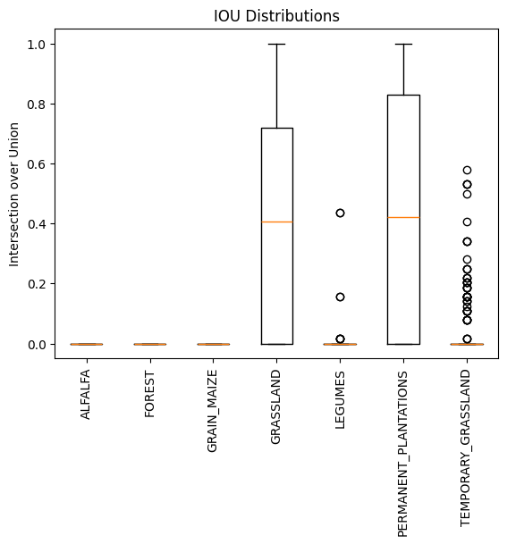

# stelar_3dunet
Bias mitigation strategies for agricultural crop type prediction using 3D U-net for spatio-temporal semantic segmentation

Code for 3D unet is adopted from Bhattiprolu, S. (2023). python_for_microscopists. GitHub. https://github.com/bnsreenu/python_for_microscopists/blob/master

Below is the dictionaly of crop types to predict: 

{ 0:'NA' , 1: 'ALFALFA', 2: 'BEET', 3: 'CLOVER', 4: 'FLAX', 5: 'FLOWERING_LEGUMES', 6: 'FLOWERS', 7: 'FOREST', 8: 'GRAIN_MAIZE', 9: 'GRASSLAND', 10: 'HOPS', 11: 'LEGUMES', 12: 'VISTA_NA', 13: 'PERMANENT_PLANTATIONS', 14: 'PLASTIC', 15: 'POTATO', 16: 'PUMPKIN', 17: 'RICE', 18: 'SILAGE_MAIZE', 19: 'SOY', 20: 'SPRING_BARLEY', 21: 'SPRING_OAT', 22: 'SPRING_OTHER_CEREALS', 23: 'SPRING_RAPESEED', 24: 'SPRING_RYE', 25: 'SPRING_SORGHUM', 26: 'SPRING_SPELT', 27: 'SPRING_TRITICALE', 28: 'SPRING_WHEAT', 29: 'SUGARBEET', 30: 'SUNFLOWER', 31: 'SWEET_POTATOES', 32: 'TEMPORARY_GRASSLAND', 33: 'WINTER_BARLEY', 34: 'WINTER_OAT', 35: 'WINTER_OTHER_CEREALS', 36: 'WINTER_RAPESEED', 37: 'WINTER_RYE', 38: 'WINTER_SORGHUM', 39: 'WINTER_SPELT', 40: 'WINTER_TRITICALE', 41: 'WINTER_WHEAT'}

# Ensamble of models

## Experiment 0

This is a small scale example with lower coverage of landscape and less number of crop types. In this experiment we just considered the 10 percent of overall landscape. We consider corpp types ALFALFA, FOREST, GRAIN_MAIZE, GRASSLAND, LEGUMES, PERMANENT_PLANTATIONS and TEMPORARY_GRASSLAND and train three models to predict these crop types: 

Below are the results: 

### Considered crop type distribution

### Intersection over union for crop types

#### Qualitative results : 

1. Sample 1

1. Sample 2

1. Sample 3

## Experiment 1 
We train 11 different models such that each model predicts three crop types. We then create an ensamble of models and post process a cosolidated crop type prediction by the ensamble of models on a given spatio-temporal patch. 

Each of the 11 models trained as follows :

model 1 : 
    types : NA, ALFALFA, BEET, CLOVER
    samples : 850 each

model 2 : 
    types : NA, FLAX, FLOWERING_LEGUMES, FOREST

    .
    .
    .
model 11:
    ...

#### Crop type representation in training data

### Intersection over union for crop types

#### Qualitative results : 

1. Sample 1

2. Sample 2

3. Sample 3

4. Sample 4

